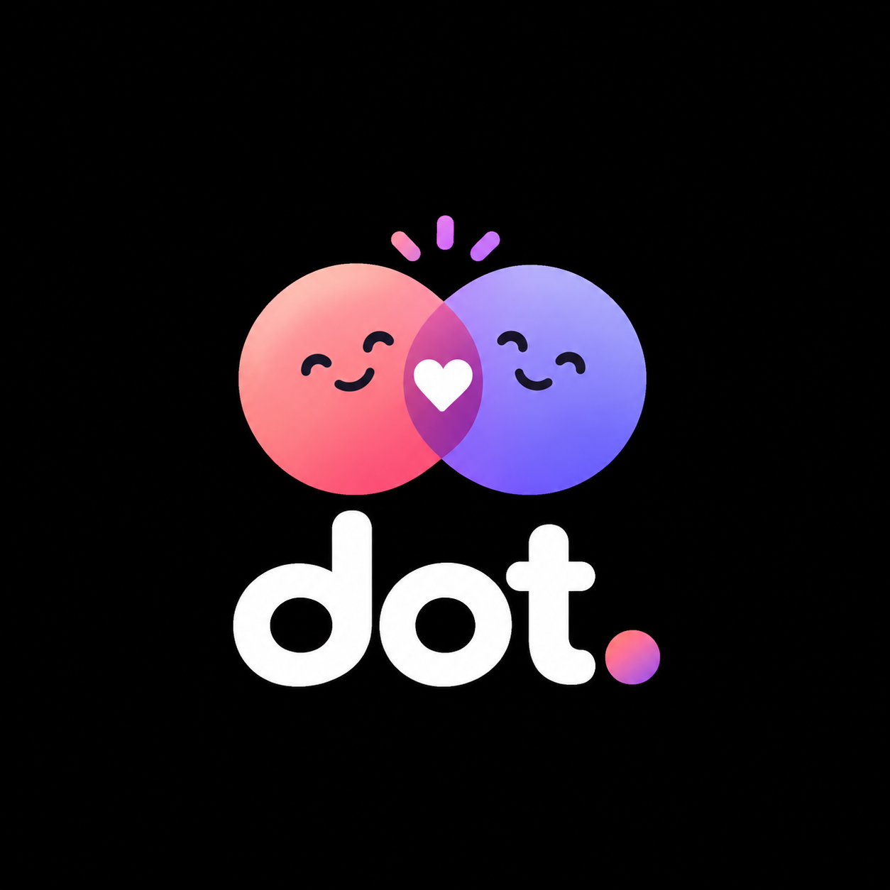

<p align="center">
  
</p>

<h1 align="center">Dot</h1>

<p align="center">
  <strong>Build better habits, together.</strong>
</p>

---

## What is Dot?

Dot is a shared habit and routine tracker for couples and friends. It connects two people so they can create and track daily habits together, organize routines like workouts, studying, and sleep schedules, and see each other's activities and progress on a shared timeline.

You can see which tasks were completed or missed, add a note explaining why you missed a scheduled activity, and set smart alarms for the routines that matter most.

Dot is built around encouragement, consistency, and mutual support, not pressure or competition.

## Tech Stack

- **Frontend:** React native
- **Backend:** Node.js, Express.js
- **Database:** MongoDB

## Project Status

Dot is currently in development.

## Getting Started

```bash
git clone https://github.com/MOHITGODARA1/Dot.git
cd dot
```

Install dependencies and start the application by following the setup instructions for each part of the project.

---

<p align="center">
  Made with care for people who grow together.
</p>
