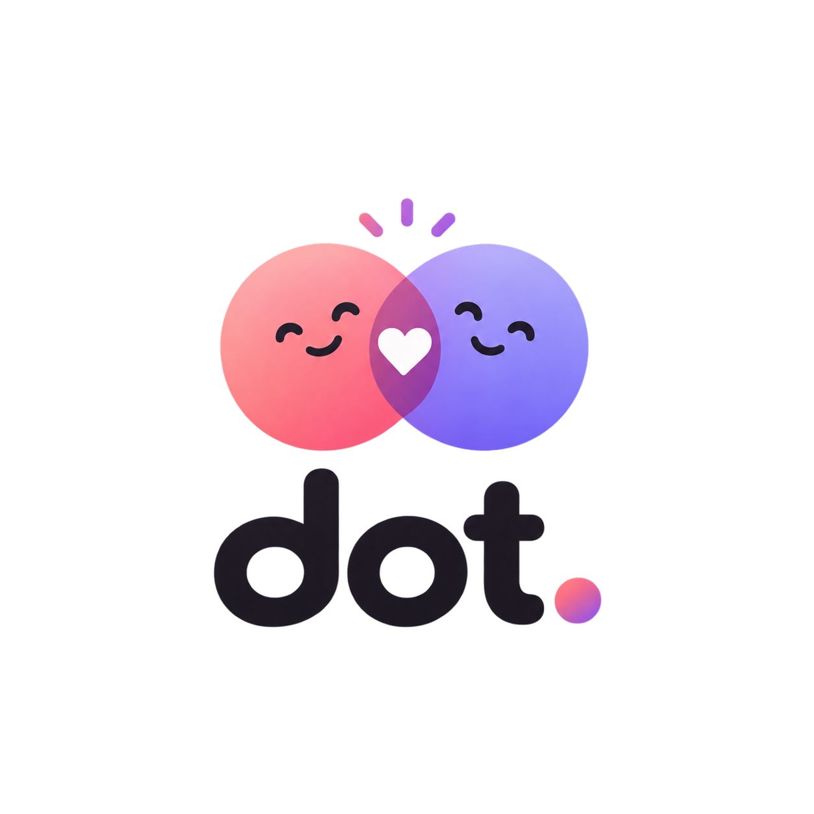

# Dot

<p align="center">
  
</p>

<p align="center">
  <strong>Build better habits, together.</strong>
</p>

Dot is a shared habit and routine tracker designed for couples and friends. It helps two people stay connected, track daily activities, and motivate each other to maintain consistent routines.

## Features

- **Shared Habit Tracking:** Create and track daily habits together.
- **Daily Routines:** Organize activities such as workouts, studying, and sleep schedules.
- **Activity Timeline:** View your partner's daily activities and progress.
- **Progress Tracking:** See completed and missed tasks.
- **Missed Habit Notes:** Add a reason when you miss a scheduled activity.
- **Smart Alarms:** Set reminders for important routines.
- **Partner Connection:** Connect with one person and share your daily progress.

## Tech Stack

- **Frontend:** React.js
- **Backend:** Node.js, Express.js
- **Database:** MongoDB

## Project Status

Currently in development.

## Our Philosophy

Dot is built around encouragement, consistency, and mutual support—not pressure or competition.

## Getting Started

Clone the repository:

```bash
git clone https://github.com/MOHITGODARA1/Dot.git
```

Navigate to the project directory:

```bash
cd dot
```

Install dependencies and start the application according to the setup instructions.

---

<p align="center">
  Made with care for people who grow together.
</p>